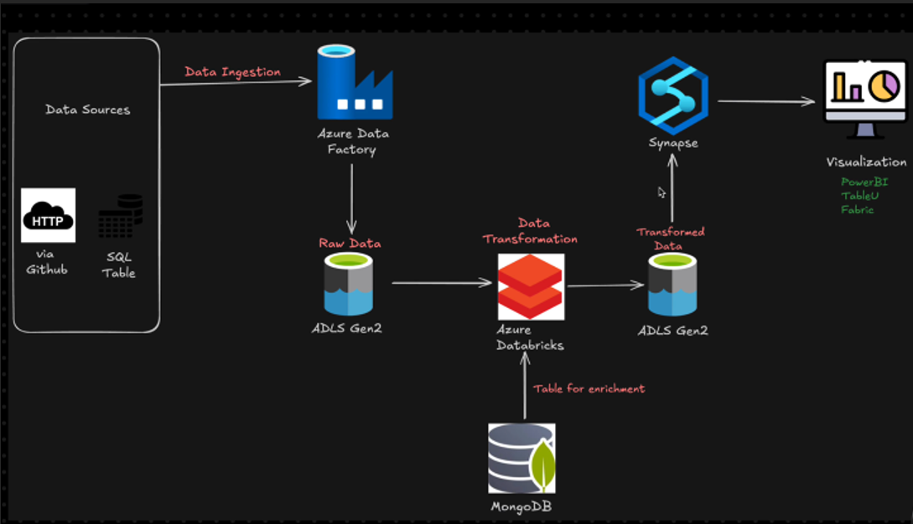
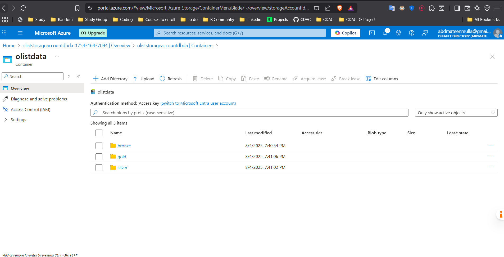
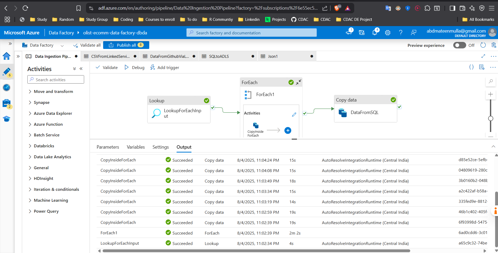
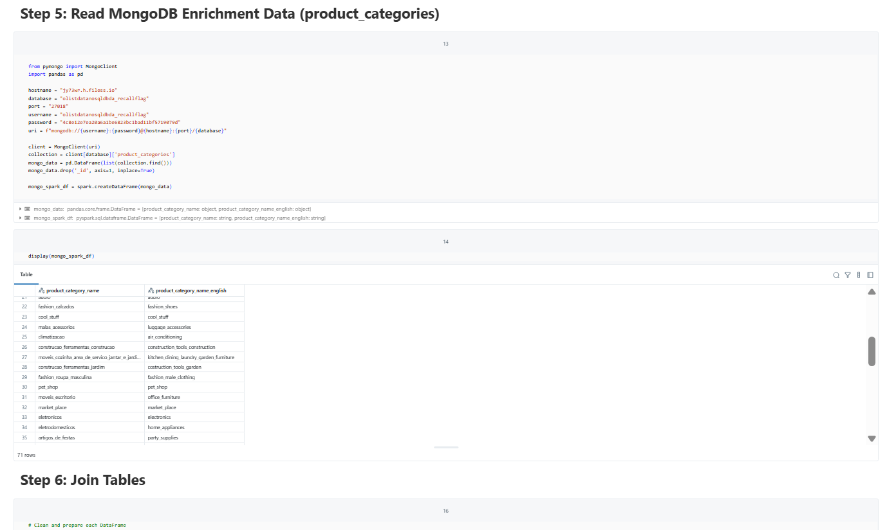

### 💡 **Project Summary – Data Engineering Pipeline on Azure Cloud**

#### 📌 Project Title

**Data Engineering Pipeline on Azure Cloud**

#### 🚀 Objective

To build a scalable, end-to-end data pipeline on Microsoft Azure using modern data engineering tools and services. The pipeline facilitates the ingestion, transformation, storage, and analytics of structured and semi-structured data from multiple sources for advanced business intelligence and reporting.

---

### 🔧 **Architecture Overview**



The pipeline is designed following the medallion architecture (Bronze → Silver → Gold). Below are the primary components:

#### 1. **Data Sources and Data Linkk**



* External data from **Kaggle**, **GitHub**, **MySQL**, and **MongoDB**.
* Data extracted using **Azure Data Factory (ADF) to Azure Data Lake**.

#### 2. **Ingestion Layer (Bronze)**



* **Azure Data Factory (ADF)** pipelines ingest raw data from:

  * MySQL (structured data)
  * MongoDB (semi-structured/NoSQL)
  * GitHub/Kaggle CSV files
* Ingested data is stored in **Azure Data Lake Storage Gen2 (ADLS Gen2)** in the **Bronze layer**.

#### 3. **Transformation Layer (Silver)**



* **Azure Databricks (PySpark)** is used for:

  * Data cleansing, flattening nested JSON
  * Handling nulls, joins, and schema evolution
* Transformed and validated data is stored back to **ADLS Gen2 Silver layer**.

#### 4. **Serving Layer (Gold)**

* Refined data from Silver layer is further processed in Databricks.
* Output is written to the **Gold directory** in ADLS Gen2.
* Data is also ingested into **Azure Synapse Analytics** via **Linked Services** for analysis.

#### 5. **Data Access & Reporting**

* **External tables in Synapse** created on top of the Gold layer.
* Can be connected to **Power BI** for dashboards and analytics.

---

### 🧰 **Tools & Technologies Used**

| Category          | Tools/Services               |
| ----------------- | ---------------------------- |
| Cloud Platform    | Azure Cloud                  |
| Orchestration     | Azure Data Factory           |
| Storage           | Azure Data Lake Storage Gen2 |
| Processing Engine | Azure Databricks (PySpark)   |
| Database          | MySQL, MongoDB               |
| Data Warehousing  | Azure Synapse Analytics      |
| Visualization     | Power BI                     |
| Languages         | Python, SQL                  |
| Source Control    | GitHub                       |

---

### 📊 **Pipeline Flow Summary**

1. **Extract**: ADF copies data from MySQL, MongoDB, GitHub, and Kaggle.
2. **Load**: Raw data is staged into ADLS Gen2 Bronze zone.
3. **Transform**: Databricks notebooks clean and process data into the Silver zone.
4. **Model & Serve**: Business logic applied to create Gold layer, then pushed to Synapse.
5. **Query & Visualize**: External tables in Synapse enable efficient querying from BI tools.

---

### 📌 Key Features

* Modular pipeline architecture (Bronze/Silver/Gold)
* Integration with both SQL and NoSQL data sources
* Fault-tolerant and scalable using Databricks and ADF
* Supports advanced analytics through Synapse + BI tools
* Uses CI/CD principles via GitHub and ADF linked services

---

### 📁 Sample Folder Structure
```
/Data-Engineering-Pipeline-on-Azure/
│
├── /data_sources/               # Info about MySQL, MongoDB, GitHub
├── /notebooks/                 # Databricks PySpark notebooks
├── /pipelines/                 # ADF pipeline JSONs or screenshots
├── /synapse/                   # SQL scripts for external tables
├── /docs/                      # Architecture diagrams/screenshots
├── README.md                   # Project summary and instructions
```


# Data Engineering Pipeline on Azure Cloud

## 🚀 Objective
To build a scalable, end-to-end data pipeline on Microsoft Azure using modern data engineering tools. The pipeline facilitates ingestion, transformation, storage, and analytics of data for business intelligence and reporting.

---

## 🏗️ Architecture Overview

### Overall Architecture


---


---

### 4. Serving Layer: Azure Synapse Analytics

- External tables created on Gold layer
- Connected to BI tools like Power BI or Tableau


